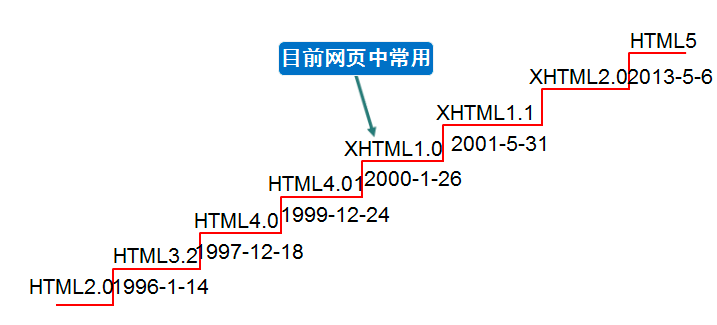

# HTML 的发展

## HTML 概述

**HTML** 全称为 HyperText Markup Language，译为**超文本标记语言**。

HTML 不是一种编程语言，是一种描述性的**标记语言**。

**作用**：HTML是负责描述文档语义的语言。

### 超文本

所谓的超文本，有两层含义：

（1）图片、音频、视频、动画、多媒体等内容，成为超文本，因为它们超出了文本的限制。

（2）不仅如此，它还可以从一个文件跳转到另一个文件，与世界各地主机的文件进行连接。即：超级链接文本。

### 标记语言

HTML 不是一种编程语言，是一种描述性的标记语言。这主要有两层含义：

（1）标记语言是一套标记标签。比如：标签`<a>`表示超链接、标签``表示图片、标签`<h1>`表示一级标题等等，它们都是属于 HTML 标签。

说的通俗一点就是：网页是由网页元素组成的，这些元素是由 HTML 标签描述出来，然后通过浏览器解析，就可以显示给用户看了。

（2）编程语言是有编译过程的，而标记语言没有编译过程，HTML标签是直接由浏览器解析执行。

### HTML 的历史

在最初的5年中（1990-1995），HTML经历了若干次修订和扩展。最初由 CERN 主要托管，随后是 IETF。

随着 W3C 的诞生，HTML 的开发再次易主。1995 年第一次扩展 HTML 的尝试（HTML 3.0）以失败告终，随后转变为更加务实的 HTML
3.2，在 1997 年完成。 就在同年很快开始了 HTML4 的开发。

随后一年 W3C 成员决定停止 HTML 的演变，并开始开发基于 XML 的替代品 XHTML。 该 工作首先将 HTML4 重新规划为 XML，也就是著名的
XHTML 1.0。 唯一增加的特性就是新的序列化，该工作在 2000 年完成。 XHTML 1.0 之后，在 XHTML 模块化的口号下 W3C
的主要精力转向让其他工作组更容易地扩展 XHTML。 与此同时，W3C 致力于一门新的、与此前的 HTML 和 XHTML 都不兼容的语言：XHTML2。

大概在 1998 年 HTML 停止演化的时候，浏览器厂商开发的部分 HTML API 被标准化和发布在 DOM Level 1（1998） 和 DOM
Level 2 Core，以及 DOM Level 2 HTML（2000年开始2003年完成）中。 在 2004 年发布了一些 DOM Level 3
标准，但是 Level 3 草案尚未全部完成工作组就关闭了。 这些工作也最终不了了之。

2003 年 XForms （一项定位于下一代 Web 表单的技术）的发布 重新激起了对 HTML 演化的兴趣，而不是像从前那样寻求新的替代品。 这时人们发现
XML 作为 Web 技术的部署只局限于全新的技术（比如 RSS 和后来的 Atom）， 而不是取代已经部署的技术（比如 HTML）。

概念验证显示，在不要求浏览器实现与现存 HTML Web 页面不兼容的渲染引擎的情况下， 也可能扩展 HTML4 的表单来提供 XForms 1.0
引入的很多特性。 这一概念验证是对 HTML 重新燃起的兴趣产生的第一项成果。 在这早期阶段，虽然本草案已经公开可用且已广泛征求建议，该标准只在 Opera
Software 版权下发布。

应该重新开启 HTML 演化的想法在 W3C 工作组得到了测试。 Mozilla 和 Opera 共同向 W3C 工作组提交了提议，包括 HTML5
工作背后的一些原则（见下文），以及前述的只涉及表单特性的早期草案。 该提议因为与此前选择的 Web 演化方向冲突而被拒绝， W3C
职员和会员投票支持继续开发基于 XML 的替代品。

此后 Apple，Mozilla 和 Opera 共同声明他们将继续在 WHATWG（一个新的组织）团体下投入工作。
他们为此创建了一个公开的邮件列表，草案也移交到了 WHATWG 网站。随后版权也修改为这三家共同拥有， 同时允许该标准的重用。

WHATWG 基于若干核心原则，具体地：技术需要向后兼容，标准和实现需要相符（即使这意味着更改标准而不是实现），
标准需要足够详细来使得一个实现在不需对其他实现进行逆向工程的情况下，就能可达到完全的互操作性。

其中后一个原则，要求 HTML5 标准的范围应包括先前在 HTML4，XHTML1，和 DOM2 HTML 这三篇独立的文档中标准化的内容。
同时意味着相比于此前的考虑，需要显著地引入更多的细节。

2006 年，W3C 暗示了参与 HTML5 开发的兴趣，并于 2007 年组建了工作组来与 WHATWG 共同开发 HTML5 标准。
Apple，Mozilla，和 Opera 允许 W3C 在 W3C 版权下发布该标准， 只要保留一版 WHATWG 网站的那份较少限制的许可协议。

数年中各方一同工作，然而在 2011 年，这些工作组最终发现他们有着不同的目标： W3C 希望发布一个"完成的" HTML5 版本，而 WHATWG
希望持续地维护一个 HTML Living Standard， 持续地维护该标准而不是锁定在一个带着已知问题的状态， 同时按照需求增加新的特性来发展整个平台。

从此 WHATWG 一直在（与其他组织一同）开发该标准， W3C 则复制 WHATWG 的修复工作到他们所在的文档分支（也有其他的一些改动）。

## HTML 名词

- **网页**：由各种标记组成的一个页面就叫网页。

- **主页(首页)**: 一个网站的起始页面或者导航页面。

- **标记**：比如`
`称为开始标记 ，`
`称为结束标记，也叫标签。每个标签都规定好了特殊的含义。

- **元素**：比如`
`内容`
`称为元素。

- **属性**：给每一个标签所做的辅助信息。

- **XHTML**：符合XML语法标准的HTML。

- **DHTML**：dynamic，动态的。`javascript` + `css` + `html`合起来的页面就是一个 DHTML。

- **HTTP**：超文本传输协议。用来规定客户端浏览器和服务端交互时数据的一个格式。SMTP：邮件传输协议，FTP：文件传输协议。
