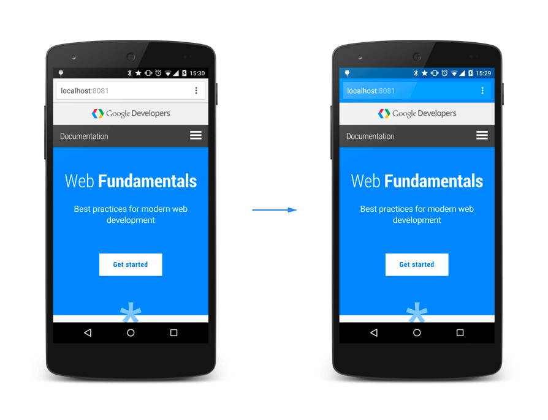

# HTML 规范中定义的标准元数据名称

`<meta>` 元素可用于提供 名称-值 对形式的文档元数据，`name` 属性为元数据条目提供名称，而 `content` 属性提供值。

以下是 HTML 定义的标准元数据 `name` 的名称：

## 1. `application-name` 网页中所运行的应用程序的名称

浏览器可能使用此名称来识别应用程序，但是简单的网页不应当使用。

```html
<meta name="application-name" content="网页的描述">
```

## 2. `author` 文档作者的名字

```html
<meta name="author" content="TimeAway">
```

## 3. `description` 页面内容的描述

一段简短而精确的、对页面内容的描述。一些浏览器，比如 Firefox 和 Opera，将其用作书签的默认描述。

```html
<meta name="description" content="网页的描述">
```

## 4. `generator` 生成此页面的软件的标识符（identifier）

## 5. `keywords` 与页面内容相关的关键词，使用逗号分隔

## 6. `referrer` 控制由当前文档发出的请求的 HTTP Referer 请求头

`<meta name="referrer">` 的 `content` 属性的值如下：

### 6.1 no-referrer

不发送 HTTP Referer 请求头。

### 6.2 origin

只发送当前文档的 origin（相同的 HTTP 协议、主机、端口）。

### 6.3 no-referrer-when-downgrade（默认值）

如果请求目标与当前页面一样安全或者更加安全（HTTP(S)→HTTPS），则发送完整 URL；

如果请求目标更加不安全（HTTPS→HTTP），则不发送  referrer。

### 6.4 origin-when-cross-origin

对同源请求发送完整 URL（不含 URL 参数），其他情况下，只发送 origin。

### 6.5 same-origin

对同源请求发送完整 URL（不含 URL 参数），其他情况下，请求不包含 referrer 请求头。

### 6.6 strict-origin

如果请求目标与当前页面一样安全或者更加安全（HTTP(S)→HTTPS），则发送 origin；

如果请求目标更加不安全（HTTPS→HTTP），则不发送  referrer。

### 6.7 strict-origin-when-cross-origin

对同源请求发送完整 URL（不含 URL 参数）；

其他情况下，如果请求目标与当前页面一样安全或者更加安全（HTTP(S)→HTTPS），则发送 origin；

如果请求目标更加不安全（HTTPS→HTTP），则不发送  referrer。

### 6.8 unsafe-URL

对同源请求和跨源请求发送完整 URL（不含 URL 参数）。


## 7. theme-color 当前页面的建议颜色

在自定义当前页面从或页面周围的用户界面的显示时，用户代理应当使用此颜色。
content 属性应当包含一个有效的 CSS <color> 值。

```html
<meta name="theme-color" content="#4285f4">
```

其效果如图所示：

## 8. color-scheme 一种或多种配色方案

浏览器将优先采用此元数据的值，然后再使用用户的浏览器或设备设置，来确定页面上的各种默认颜色和元素外观，
例如背景色、前景色、窗体控件和滚动条。

<meta name="color-scheme"> 的主要用途是指示当前页面与浅色模式和深色模式的兼容性，
以及选用这两种模式时的优先顺序。

color-scheme 的 content 属性的值应当为以下值中的一个：

- normal

该文档未指定（unaware of）配色方案，应当仅使用默认配色进行渲染。

- [light | dark]+

文档所支持的一种或多种配色方案。如果多次指定同一个配色方案，则与仅指定一次效果相同。
如果指定了多种配色方案，则表示文档优先选择第一种方案——如果用户更倾向于选择第二种配色方案，则可以接受第二种。

- only light

表示文档仅支持浅色模式，也就是浅色背景色和深色前景色。按照规范，only dark 是无效的。

```html
<meta name="color-scheme" content="dark light">
```

---

CSS 设备适配规范（CSS Device Adaptation specification）定义了以下元数据名称：

## 9. viewport 视口的初始大小提供指示，仅用于移动设备

### 9.1 width

定义 `viewport` 的宽度，如果值为正整数，则单位为像素。值也可以是字符串 "device-width"。

### 9.2 height（不建议）

定义 `viewport` 的高度。一个正整数或者字符串 "device-height"。

### 9.3 initial-scale

定义设备宽度与 viewport 大小之间的缩放比例。取值为 0.0 - 10.0 之间的整数。

设备宽度取值：宽度和高度中更小的那个，如果是纵向屏幕，就是 device-width；如果是横向屏幕，就是 device-height。

### 9.4 maximum-scale

定义缩放的最大值，必须大于等于 minimum-scale。取值为 0.0 - 10.0 之间的整数。

### 9.5 minimum-scale

定义缩放的最小值，必须小于等于 maximum-scale。取值为 0.0 - 10.0 之间的整数。

### 9.6 user-scalable

默认为 yes，如果设置为 no，用户将无法缩放当前页面。

### 9.7 viewport-fit

值如下：

- auto 不影响初始布局视口，整个web页面是可视的。

- contain 视口被缩放以适合显示内的最大矩形。

- cover 视口被缩放以填充设备显示。强烈建议使用安全区域内插入变量，确保主要内容不被显示在屏幕之外。
