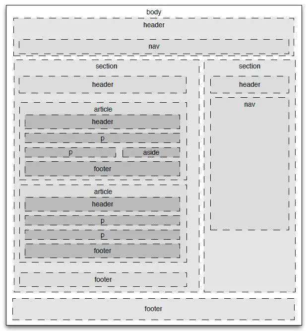

# HTML 语义化标签

## 1. 什么是语义化

> **语义化**，指对文本内容的结构化（内容语义化），选择合乎语义的标签（代码语义化），便于开发者阅读，
> 维护和写出更优雅的代码的同时，让浏览器的爬虫和辅助技术更好的解析。

## 2. 为什么要关注语义化

- **可访问性**：帮助辅助技术更好的阅读和转译你的网页，利于无障碍阅读；

- **可检索性**：有了良好的结构和语义，可以提高搜索引擎的有效爬取，提高网站流量；

- **国际化**：全球只有 13%的人口是英语母语使用者，因此通用的语义化标签可以让各国开发者更容易弄懂你网页的结构；

- **互用性**：减少网页间的差异性，帮助其他开发者了解你网页的结构，方便后期开发和维护；

## 3. 被滥用的语义化标签

- `blockquote`：一些人通过使用 `<blockquote>` 标签使文本达到缩进的目的，因为引用默认会进行文本缩进。
  如果你仅仅是想使文本达到缩进目的，而文本自身并非引用，那么就用 CSS `margin` 来代替；

- `p`：一些开发者用 `
` 来为标签自检增加额外的空白段落，这里应该使用 CSS 的 `margin/padding` 来实现；

- `ul`：一些开发者往 `<ul>` 中添加文本来达到文本缩进的目的，这种做法即不符合语义化要求，同样也是非法的 HTML 实践。
  `<ul>`标签中只能有 `<li>` 标签。

- `<h1>~<h6>`：该标签可以使文本字体变大，变粗，但如果文本并非是标题，应该使用 CSS `font-weight` `font-size`；

总结：其实上面四个例子都是为了说明一点，用正确的标签做正确的事。

## 4. HTML5 语义化

> 在 HTML5 出来之前，我们习惯于用 `div` 来表示页面的章节或者不同模块，但是 `div` 本身是没有语义的。
> 但是现在，HTML5 中加入了一些语义化标签，来更清晰的表达文档结构。
> 而 `div` 作为一个没有任何语义，仅仅是用来构建结构的元素，是最适合做容器的标签。

### 4.1 `<header>` 标签

- 定义文章的介绍信息：标题，Logo，slogan；包裹目录部分，搜索框，一个 nav 或者任何相关的 logo；

- 一个页面中 `<header>` 的个数没有限制，可以为每个内容块添加一个 `<header>`；

### 4.2 `<nav>` 标签

- 定义文章导航栏，导航栏通常包括菜单、目录、索引等;

- `<nav>` 一般和 ul、li 配合做导航栏；

### 4.3 `<main>` 标签

- 呈现了文档的主体部分，侧边栏、导航栏链接、版权信息、网站 Logo，搜索框，都不应当被包含在其内。

- `<main>` 元素的内容应当是独一无二的，即 `<main>` 也应该只有一个。

### 4.4 `<article>` 标签

- 一份独立的内容，通常包括标题作为自己的子元素，当 `<article>` 元素嵌套使用时，则该元素代表与外层元素有关的文章。

### 4.5 `<section>` 标签

- 与 `<article>` 的差别在于，它是整体的一部分，或者是文章的一节，一般来说 `<section>` 也会带有标题；

### 4.6 `<aside>` 标签

- 表示一个和其余页面内容几乎无关的部分，被认为是独立于该内容的一部分并且可以被单独的拆分出来而不会使整体受影响。
  其通常表现为侧边栏或者标注框（call-out boxes）。

### 4.7 `<footer>` 标签

- 表示最近一个章节内容或者根节点（sectioning root ）元素的页脚。
  一个页脚通常包含该章节作者、版权数据或者与文档相关的链接等信息。
